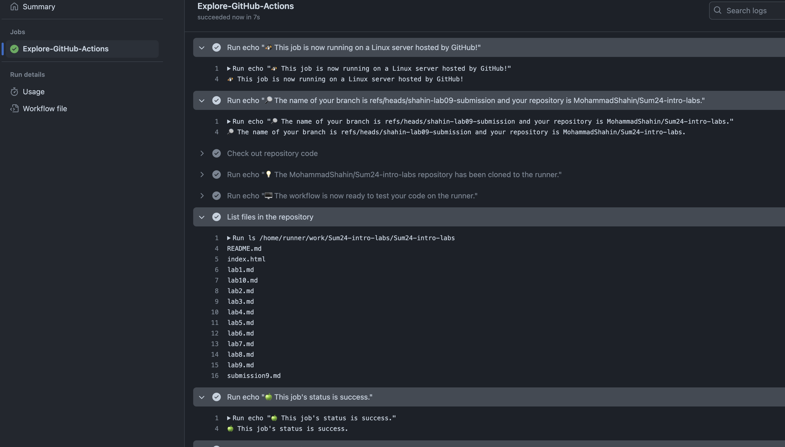

## Task 1

Github actions is a platform for CI/CD. We can manage builds, tests, deployments using Github actions. Github actions work by creating a workflow that specifies what needs to be done (commands) and when (what triggers a workflow to start). A workflow is just a pipeline of jobs that needs to be done. A trigger (event) can be a pull request, new commit, manual, etc. For example, we can have a workflow in a repository of a website that deploys to AWS on every pull request. The jobs of this workflow would be cloning the repository, installing the dependencies, running the tests, and finally pushing to AWS with the correct credentials. If any of these jobs fail, the site won't reflect the changes from the latest pull request. 

To add a new workflow, we just needs to create a new folder `.github/workflows` and add workflow file there. The workflow is jsut a yaml file that specifies what jobs need to executed. In the quick start, we created `github-actions-demo.yml` that contains a single job. This job has multiple steps: it echos the repository's name, user, and the files in the github.

The workflow worked as expected without any errors.

